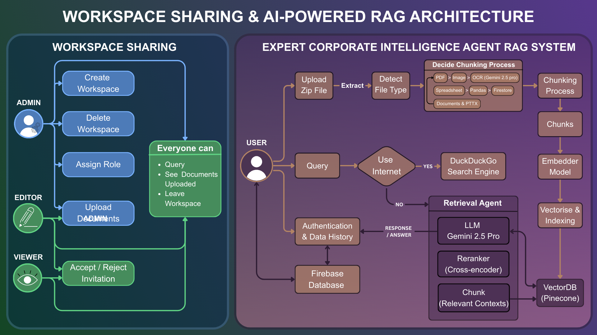

# 🤖 Expert Corporate Intelligence Agent RAG System


> **Note:** This project was developed during my AI & Machine Learning internship at **Innoveam Sdn Bhd**. It demonstrates a Retrieval-Augmented Generation (RAG) pipeline designed to allow employees to query internal documents using natural language.

---
## 🔒 Intellectual Property & Code Access

**Please Note:** This project was developed as a proprietary tool for **Innoveam Sdn Bhd**. Due to Non-Disclosure Agreements (NDA) and Private & Confidential (P&C) restrictions, the source code cannot be made public.

This repository serves as a **technical showcase** of the system architecture, design decisions, and problem-solving strategies employed during development.

**If you are a hiring manager:**
I am happy to discuss the architecture, the technical challenges (e.g., mitigating hallucinations in financial data), and my specific contributions to this project in an interview setting, within the boundaries of my confidentiality agreements.

## 🎥 Demo

📼 (https://via.placeholder.com/800x400?text=Insert+Your+Demo+GIF+Here)

---

## 📖 Project Overview

This application bridges the gap between static documents and dynamic intelligence. It processes document uploads, chunks the text into vector embeddings, stores them in **Pinecone**, and retrieves relevant context to generate accurate answers using **Large Language Models (LLMs)**.

### 🚩 Problem Statement
Traditional methods for extracting corporate knowledge face three critical challenges:
1.  **Data Lock:** Critical insights are trapped in unstructured formats (PDFs, images) that standard database tools cannot query.
2.  **Accuracy Gaps:** Generic OCR tools frequently misread financial digits (e.g., confusing '8' for '3') in complex table structures.
3.  **Lack of Auditability:** Standard LLMs often produce "hallucinations" without provenance, rendering them unsuitable for verifiable corporate decision-making.

### 🎯 Project Objectives
To address these risks, this system was built with the following technical goals:
* **High-Fidelity Ingestion:** Utilize Vision-Language Models (Gemini 2.5 Pro) to preserve complex document layouts and financial tables with digit-for-digit accuracy.
* **Zero-Guessing Protocol:** Implement a deterministic retrieval pipeline that mandates citations for every claim and defaults to "Data Not Found" rather than inventing numbers.
* **Secure Collaboration:** Establish a multi-tenant architecture with Role-Based Access Control (RBAC) to ensure sensitive data is isolated within team workspaces.

### Key Features
* **📄 Document Ingestion:** Automated chunking and vectorization of documents.
* **🧠 Context-Aware Chat:** Uses RAG to answer questions based *only* on the provided knowledge base, reducing hallucinations.
* **⚡ Fast Retrieval:** High-performance vector search using Pinecone.
* **🛡️ Secure & Scalable:** Built with Docker support for containerized deployment.
* **💬 Interactive UI:** User-friendly chat interface built with Streamlit.

---

## 🛠️ Tech Stack

* **Frontend:** Streamlit (Custom CSS, Session State Management)
* **LLM & OCR:** Google Vertex AI (Gemini 2.5 Pro Vision)
* **Embeddings:** gemini-embedding-001 (768 dimensions)
* **Vector Database:** Pinecone (Serverless Spec)
* **Backend Orchestration:** Flask / LangChain / Custom Tool Agents
* **Database:** Firebase (Authentication & Firestore for Metadata)
* **Processing:** LibreOffice (PDF Conversion), Pandas (Data Normalization)
* **Deployment:** Docker & Docker Compose

---



### 🏗️ System Architecture Breakdown

The system is architected as a dual-module platform, combining secure enterprise collaboration (Left) with an advanced neuro-symbolic RAG pipeline (Right).

#### 1. Workspace Sharing & Governance (Left Module)
* **Role-Based Access Control (RBAC):** A strict permission hierarchy manages data isolation:
    * **Admins:** Manage workspace lifecycles (Create/Delete) and user role assignments.
    * **Editors:** Authorized to upload and curate the document knowledge base.
    * **Viewers:** Restricted to read-only query access to ensure data safety.
* **Shared Permissions:** All authenticated users can query the system, view uploaded document lists, and manage their workspace membership.

#### 2. Expert RAG Intelligence System (Right Module)
**A. The Ingestion Pipeline (Top Flow)**
* **Smart Ingestion:** The system accepts ZIP archives and automatically routes files based on type:
    * **Documents (PDF, DOCX, PPTX):** Word documents and PowerPoint presentations are first converted to PDF format. These, along with native PDFs, are then processed via a **Vision-First OCR** strategy using **Gemini 2.5 Pro**, converting document images directly into text chunks to preserve complex table structures.
    * **Spreadsheets:** Parsed via **Pandas** and stored in **Firestore** to maintain row-column integrity.
* **Vectorization:** Text chunks are passed to the Embedder Model and indexed in **Pinecone** for semantic retrieval.

**B. The Retrieval Agent (Bottom Flow)**
* **Decision Logic:** A routing node evaluates if the user's query requires external data:
    * *Yes:* Routes to **DuckDuckGo Search Engine** for real-time web information.
    * *No:* Triggers the internal RAG pipeline.
* **Deep Retrieval:**
    1.  **Hybrid Search:** Fetches relevant contexts from Pinecone.
    2.  **Cross-Encoder Reranking:** A specialized model re-scores the contexts to filter out noise.
    3.  **Generation:** The **Gemini 2.5 Pro LLM** synthesizes the final answer using the verified contexts, ensuring zero hallucinations.
* **Data Persistence:** All interactions and history are securely logged to the **Firebase Database**.

## 🚀 How to Run Locally

Since this project involves sensitive API keys, they are not included in the repository. Follow these steps to set it up on your local machine.

### 1. Clone the Repository
```bash
git clone https://github.com/404aina/RAG-Portfolio.git
cd RAG-Portfolio
```

### 2. Set Up Virtual Environment
```bash
python -m venv venv
source venv/bin/activate  # On Windows: venv\Scripts\activate
```

### 3. Install Dependencies
```bash
pip install -r requirements.txt
```

### 4. Configure Environment Variables
Create a .env file in the root directory and add your API keys:

# .env file
```bash
# --- Pinecone Configuration ---
PINECONE_API_KEY=pcsk_... #Your-Pinecone-API key-start with: pcsk..

# --- Vertex AI / Google Cloud Config ---
GOOGLE_CLOUD_PROJECT=your-project-name #Your-Google-Cloud-Project-Name
GOOGLE_CLOUD_LOCATION="us-central1"
GOOGLE_APPLICATION_CREDENTIALS=firebase_key.json

# --- Firebase Config ---
FIREBASE_PROJECT_ID=your-firebase-id
FIREBASE_WEB_API_KEY=AIza...  #Your-Firebase-WEB-API- start with: AIza
FIREBASE_ADMIN_CREDENTIALS=firebase_key.json  #Your-Firebase-admin-credential-.json file download from firebase and save as "firebase_key.json"

# --- System Paths ---
SOFFICE_CMD="C:/Program Files/LibreOffice/program/soffice.exe"  # make sure to install LibreOffice software in your device and add YOUR OWN files path "https://www.libreoffice.org/download/download-libreoffice/"
```
(Note: You must provide your own firebase_key.json file for database connections)

### 5. Run the Application
Terminal 1 (Backend):
```bash
python main.py
```
Terminal 2 (Frontend):
```bash
streamlit run app.py
```
(Note: both command need to be run in seperate terminal)

## ☁️ How to Run in GitHub Codespaces

You can run this project directly in the cloud using Docker, without installing anything on your computer.

1.  Click the **"Code"** button on this repository.
2.  Select the **"Codespaces"** tab.
3.  Click **"Create codespace on main"**.
4.  Once the terminal loads, create your `.env` and `firebase_key.json` files:
    # .env file
```bash
# --- Pinecone Configuration ---
PINECONE_API_KEY=pcsk_... #Your-Pinecone-API key-start with: pcsk..

# --- Vertex AI / Google Cloud Config ---
GOOGLE_CLOUD_PROJECT=your-project-name #Your-Google-Cloud-Project-Name
GOOGLE_CLOUD_LOCATION="us-central1"
GOOGLE_APPLICATION_CREDENTIALS=firebase_key.json

# --- Firebase Config ---
FIREBASE_PROJECT_ID=your-firebase-id
FIREBASE_WEB_API_KEY=AIza...  #Your-Firebase-WEB-API- start with: AIza
FIREBASE_ADMIN_CREDENTIALS=firebase_key.json  #Your-Firebase-admin-credential-.json file download from firebase and save as "firebase_key.json"

# --- System Paths (IMPORTANT for Codespaces) ---
SOFFICE_CMD=soffice   # You don't need to install LibreOffice if using github Codespace
```

5.  Open these files in the Codespace editor and paste your credentials.
6.  Build and run the container:
    ```bash
    docker compose up --build -d
    ```
7.  Once the build finishes, go to the **"Ports"** tab (next to the Terminal) and click on the **Globe icon** (Open in Browser) next to port `8501` to view the app.

### 6. Project Structure
```text
├── .env                   # Environment variables (Create this file!)
├── firebase_key.json      # Firebase credentials (Put your file here!)
├── app.py                 # Main Streamlit application entry point
├── main.py                # Core logic / Testing script
├── tool_agent.py          # AI agent logic and definition
├── tools.py               # Helper functions for the agent
├── pinecone_pusher.py     # Script to upload vectors to Pinecone
├── chunker.py             # Logic for splitting PDFs into chunks
├── zip_util.py            # Utility for handling zip file operations
├── requirements.txt       # Python library dependencies
├── Dockerfile             # Instructions to build the container
├── docker-compose.yml     # Docker orchestration config
├── entrypoint.sh          # Script to initialize the container
├── .dockerignore          # Files to exclude from Docker build
└── .gitignore             # Files to exclude from Git
```

### 👩‍🦰 Author
NUR AINA BATRISYIA MOHD FOUZI

- AI & Machine Learning Intern @ Innoveam Sdn. Bhd.
- Bachelor of Information Systems (Hons.) Intelligent System Engineering @ UiTM Shah Alam
